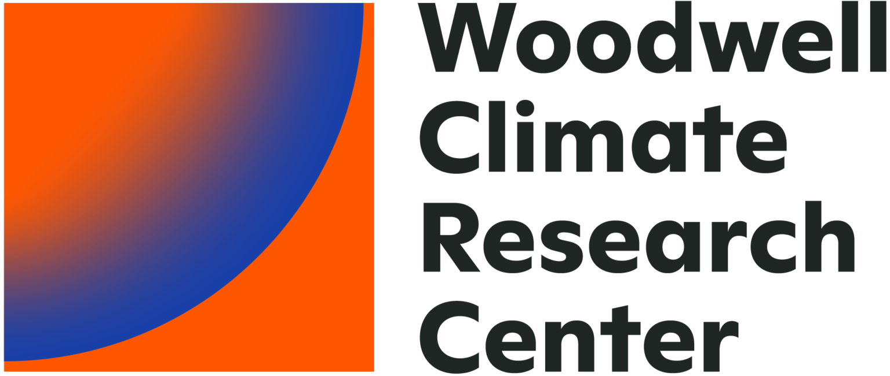
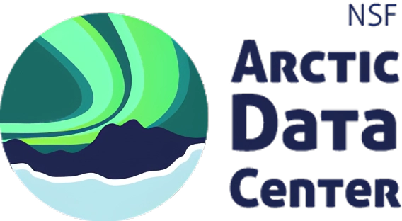
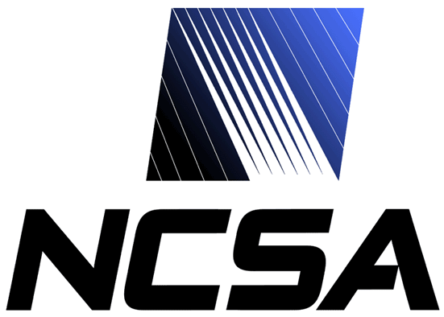
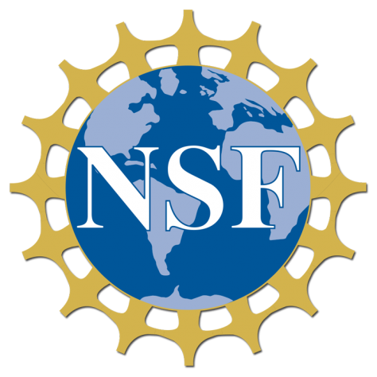

# Welcome to the 2026 GeoAI Arctic Challenge!

The 2026 GeoAI Arctic Challenge is part of the continuing series of GeoAI challenges sponsored by the National Science Foundation (NSF) and hosted by the [NSF Cyber2A project team](https://cyber2a.github.io/). This challenge aims to bring together researchers, practitioners, and students from multiple disciplines and sectors, including geospatial sciences, computer science, Earth and environmental sciences, data science, and Arctic research communities. Our goal is to broaden participation in GeoAI research and education while fostering interdisciplinary collaboration to address pressing environmental challenges facing our planet.

This year’s challenge focuses on the Arctic, one of the most rapidly changing regions on Earth. Arctic warming is transforming landscapes, ecosystems, infrastructure, and communities at an unprecedented pace. Permafrost degradation has led to the emergence and expansion of diverse surface features such as thermokarst lakes, retrogressive thaw slumps, ice-wedge degradation, and ground subsidence. These changes have significant impacts on ecosystems, hydrology, carbon cycling, infrastructure stability, and the livelihoods of Arctic communities.

The goal of the 2026 GeoAI Arctic Challenge is to advance the use of artificial intelligence and GeoAI methods for detecting and mapping Arctic permafrost features (i.e., the retrogressive thaw slumps) from multimodal remote sensing imagery and geospatial data. Through this challenge, we hope to encourage participants to develop innovative AI and deep learning models that can improve environmental monitoring and enhance our understanding of how climate change is reshaping Arctic landscapes and affecting the people who depend on them. More information about the competition can be found here: [https://cyber2a.github.io/challenge/](https://cyber2a.github.io/challenge/).

This challenge is more than a competition. It is also a platform for training, collaboration, and community building. During the challenge open period (July 1, 2026 to January 31, 2027), we will organize webinars and virtual hands-on sessions on AI, remote sensing, and deep learning methods for environmental applications. We hope these activities will help develop and diversify the next generation AI and GeoAI workforce while building a strong research network across disciplines and sectors.

The challenge is open to everyone interested in AI, geospatial sciences, environmental change, and Arctic research. Participants may join as individuals or teams. We strongly encourage and will give additional credit to teams composed of individuals with diverse backgrounds (e.g., Earth science + AI). Top-performing teams will receive cash awards ($1,000 for 1st place, $500 for 2nd place, and $200 for 3rd place) and recognition, and selected participants may have opportunities for future research collaborations and internships with our research program.

We look forward to your participation and to seeing the innovative AI solutions you will develop to help better understand and address environmental change in the Arctic.

Professor Wenwen Li  
Director, Spatial Analysis Research Center (SPARC)  
School of Geographical Sciences and Urban Planning  
Arizona State University  

## Collaborators

- Wenwen Li, Arizona State University, USA
- Chia-Yu Hsu, Arizona State University, USA
- Anna Liljedahl, Woodwell Climate Research Center, USA
- Yili Yang, Woodwell Climate Research Center, USA
- Matthew Jones, University of California, Santa Barbara, USA
- Kenton McHenry, University of Illinois at Urbana-Champaign, USA
- Patricia Solis, Arizona State University, USA
- Ingmar Nitze, Alfred Wegener Institute, Germany

## Partners

::: {layout="[[30, 30, 25, 20]]"}

:::

## Sponsors

{width=20%}

## Contact

For competition support, contact [wenwen@asu.edu](mailto:wenwen@asu.edu) or [chiayuhsu@asu.edu](mailto:chiayuhsu@asu.edu).

For technical questions that may help other teams, use the [discussion](https://huggingface.co/spaces/cyber2a/2026GeoAIArcticChallenge/discussions) area on the competition page. You may also contact the organizing team by email.