# GeoAI Arctic Challenge Dataset {id="dataset"}

The GeoAI Arctic Challenge dataset is an **instance segmentation** benchmark for detecting and delineating **retrogressive thaw slumps (RTS)** in Arctic image chips. The dataset builds on [*Yang et al.* (2023)](https://www.sciencedirect.com/science/article/pii/S0034425723000469), which provided semantic segmentation masks labeling each pixel as RTS or non-RTS. For this challenge, those labels have been extended and reformatted so each RTS feature is represented as an individual instance.

Participants receive multimodal image data and train models to predict one mask for each RTS instance in the hidden test set. This instance-level formulation supports feature-level evaluation, including how well models separate and delineate individual RTS boundaries.

Training labels are provided in COCO instance segmentation format. Test labels remain hidden and are used by the official scorer.

| Satellite Image (RGB) | Semantic Mask (Original) | Instance Mask (This Challenge) |
| :--------------------: | :--------------------: | :--------------------: |
|  | 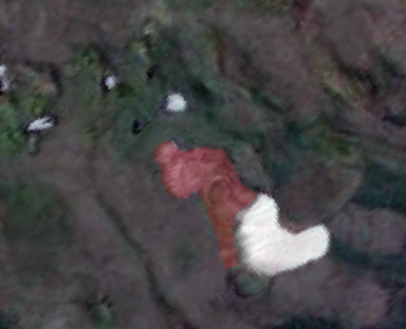 |  |
| 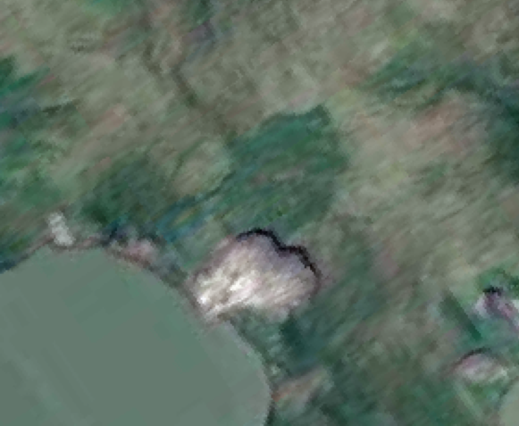 | 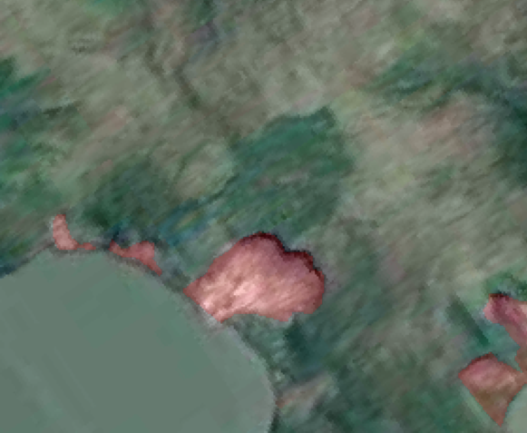 | 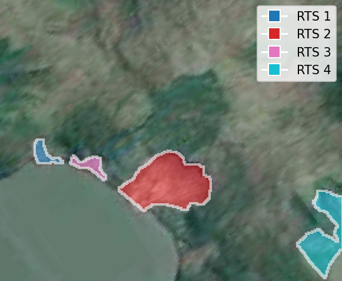 |

*Conversion from semantic RTS labels into instance-level masks. The challenge dataset uses connected-component instance labels so models can be evaluated at the feature level rather than only pixel-wise.*


## Geographic Coverage & Study Sites {id="geographic-coverage-and-study-sites"}

The source data spans seven Arctic subregions, including:

- Canada: Herschel Island, Horton Delta, Tuktoyaktuk peninsulas, Banks Island
- Russia: Yamal and Gydan peninsulas, Lena River, Kolguev Island

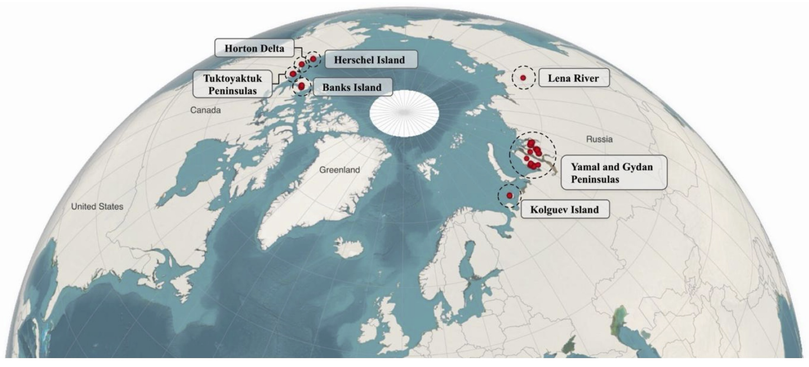  
Spatial coverage of the source Arctic RTS dataset. Credit: [*Li et al.,* 2025](https://doi.org/10.1109/JSTARS.2025.3564310).

**Note:** The competition release removes geospatial metadata from distributed image chips while preserving multimodal image information for modeling.

## Public Release Contents {id="public-release-contents"}

The public package contains training images and labels, hidden-label test images, metadata, and starter tools:

```bash
competition_release/
  README.md
  metadata/
    band_names.json
    sample_submission.json
    train_manifest.csv
    test_manifest.csv
  tools/
    coco_utils.py
    validate_submission.py
    evaluate_coco.py
    inspect_dataset.py
  examples/
    load_image_and_label.py
    make_sample_submission.py
    encode_predictions.py
  train/
    images/*.npz
    annotations/instances_train.json
  test/
    images/*.npz
```

Each `.npz` file contains one array named `image` with shape `H x W x 8` in HWC order.

## Image Bands {id="bands"}

Each image chip contains eight co-registered channels. The bands combine optical imagery, spectral features, and topographic context.

| Data layer | Source / feature type | Bands | Role in RTS mapping |
| --- | --- | --- | --- |
| RGB imagery | Maxar optical imagery | `red`, `green`, `blue` | Provides high-resolution visual context for exposed soil, vegetation disturbance, and RTS morphology. |
| Spectral features | Vegetation, water, and near-infrared features | `ndvi`, `ndwi`, `nir` | Helps distinguish thaw-related disturbance from vegetation, water, snow, and other surface conditions. |
| Terrain features | ArcticDEM-derived topographic features | `relative_elevation`, `shaded_relief` | Adds terrain structure that can improve boundary delineation. |

The array band order is:

| Index | Band name | Description |
| ---: | --- | --- |
| 0 | `red` | Maxar red |
| 1 | `green` | Maxar green |
| 2 | `blue` | Maxar blue |
| 3 | `ndvi` | Normalized Difference Vegetation Index |
| 4 | `relative_elevation` | Relative elevation |
| 5 | `shaded_relief` | Shaded relief |
| 6 | `nir` | Planet near-infrared |
| 7 | `ndwi` | Normalized Difference Water Index |

The same band list is available in machine-readable form in `metadata/band_names.json`.

## Key Dataset Statistics {id="key-dataset-statistics"}

| **Property** | **Description** |
| --- | --- |
| **Training Images** | 756 image chips with public labels |
| **Test Images** | 138 image chips without public labels |
| **Training RTS Instances** | 1,783 |
| **Hidden Test RTS Instances** | 299 |
| **Total RTS Instances** | 2,082 train + hidden-test labels |
| **Image Array Format** | `.npz` files containing `image` arrays with shape `H x W x 8` |
| **Annotation Format** | COCO instance segmentation JSON with compressed RLE masks |
| **Task** | RTS instance segmentation |
| **Category** | `{"id": 1, "name": "rts", "supercategory": "landform"}` |
| **Original Source** | [**Yang *et al.* (2023)**](https://doi.org/10.1016/j.rse.2023.113495), *Remote Sensing of Environment* |

## Label Conversion {id="label-conversion"}

Training annotations are stored in `train/annotations/instances_train.json` using COCO instance segmentation format. Instance masks are encoded as compressed COCO run-length encoding (RLE).

The label conversion rule is:

- RTS foreground: finite source `rts_label` values greater than `0`
- Background: source `rts_label == 0` or missing/no-label values
- Instances: 8-connected components over the binary RTS foreground
- Filtering: connected components smaller than 10 pixels are removed

This conversion is deterministic. If two RTS features touch in the source mask, connected-component labeling treats them as one instance.

## Dataset Distributions {id="dataset-distributions"}

### RTS Size Distribution

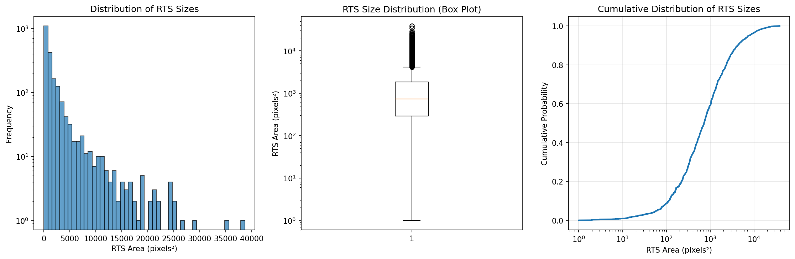

### RTS Coverage Distribution

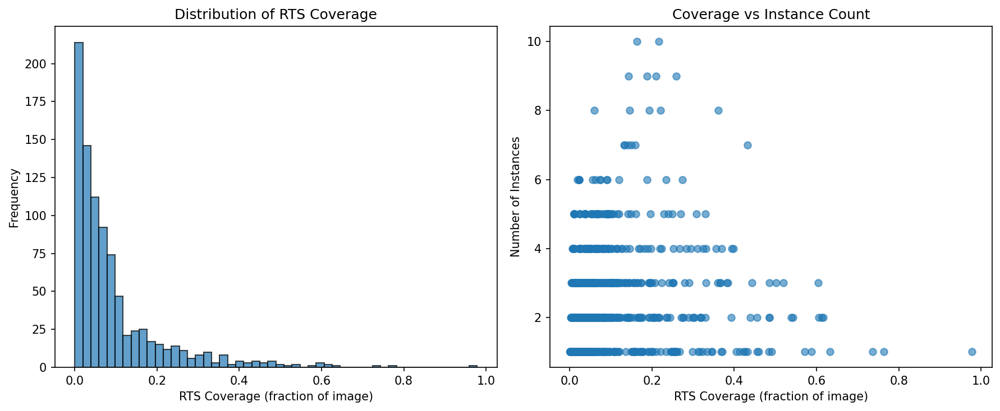

### RTS Count Distribution

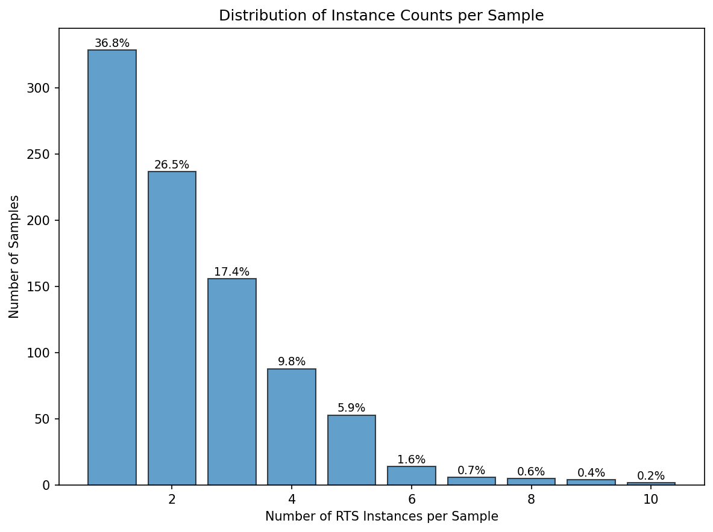{width=60% fig-align="center"}

### RTS Shape Analysis

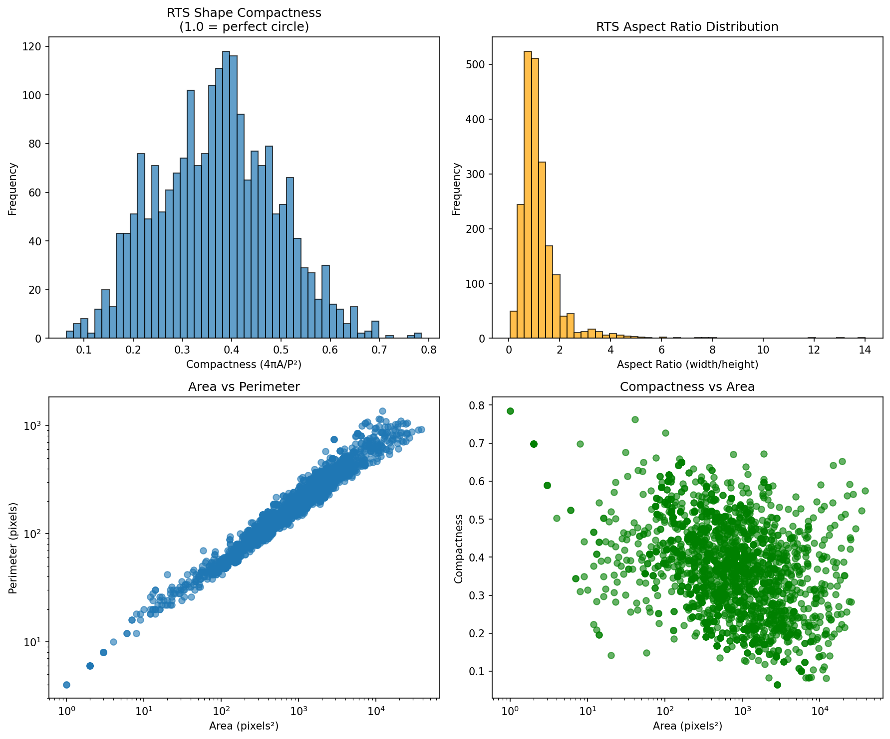

### Band Statistics

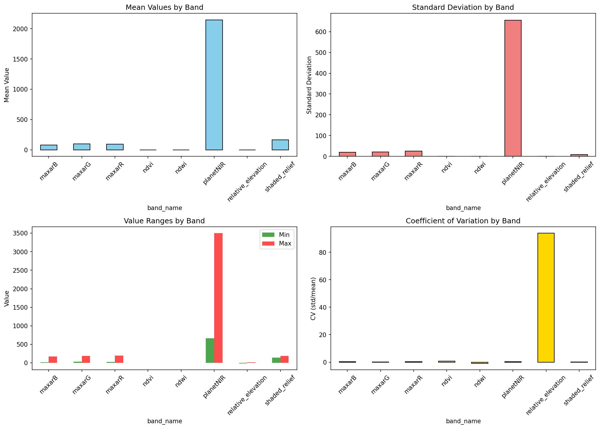

## Sample Visualizations {id="sample-visualizations"}

| Description | Satellite Image (RGB) | Instance Mask (RTS Features) | 
| :-------------------- | :--------------------: | :--------------------: |
| Single large RTS | 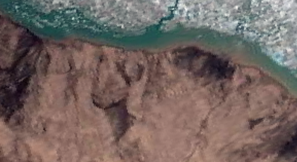 | 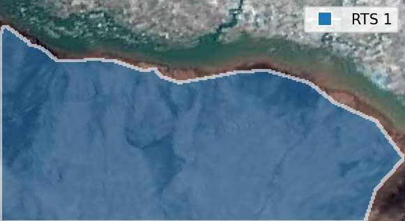 |
| Single small RTS | 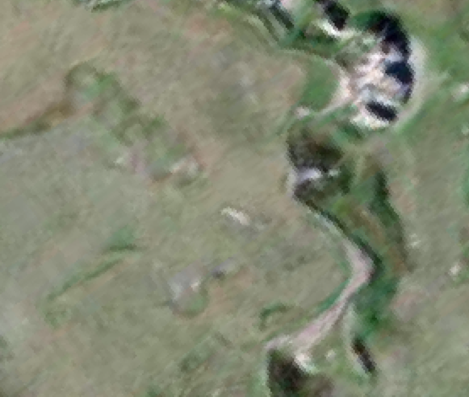 | 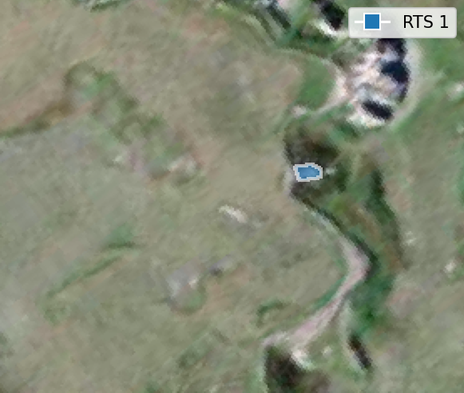 |
| Multiple RTS | 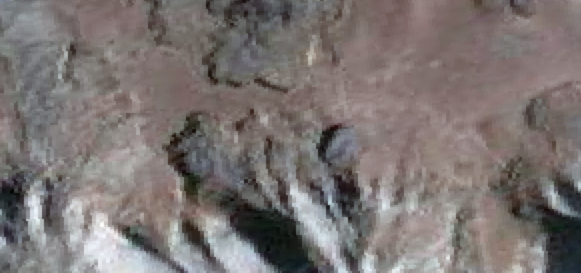 | 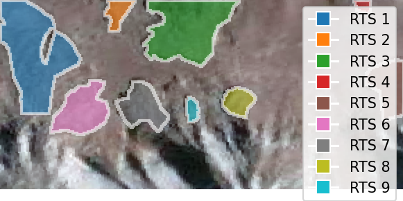 |
| RTS near snow | 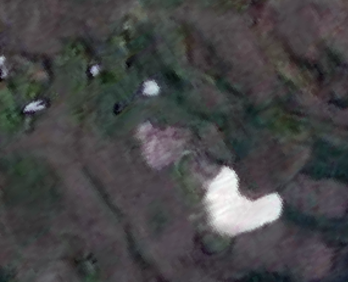 | 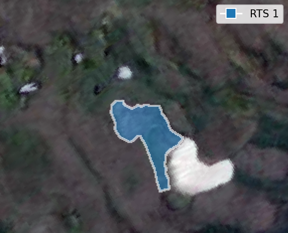 |