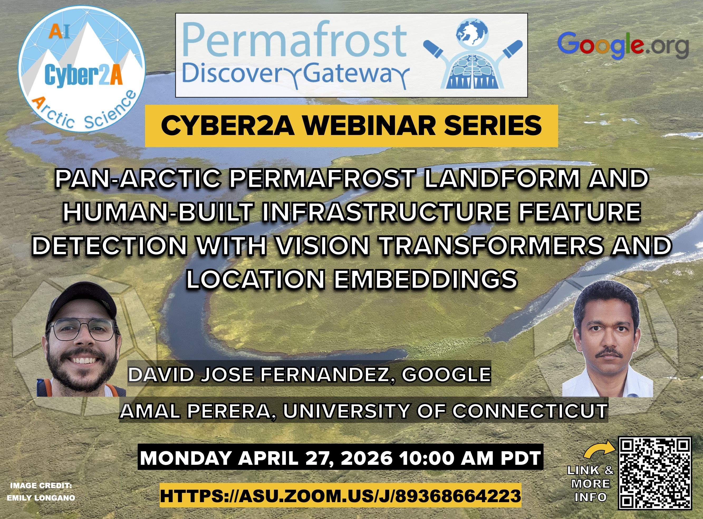

### Abstract

Accurate mapping of permafrost landforms, thaw disturbances, and human-built infrastructure at pan-Arctic scale using submeter resolution satellite imagery is increasingly critical. Handling petabyte-scale image data requires high-performance computing and robust feature detection models. While convolutional neural network (CNN) based deep learning approaches are widely used for remote sensing (RS), vision transformers (ViTs) offer advantages in capturing long-range dependencies and global context via attention mechanisms, similar to the success in transformer-based large language models. ViTs support pretraining via self-supervised learning, addressing the common limitation of labeled data in Arctic feature detection, and outperform CNNs on benchmark datasets. The Arctic domain also poses challenges for model generalization, especially when features with the same semantic class exhibit diverse spectral characteristics. To address these issues for Arctic feature detection, we integrate geospatial location embeddings into ViTs to improve adaptation across regions. This work investigates the suitability of pretrained ViTs as feature extractors for high-resolution Arctic RS tasks and the benefit of combining image and location embeddings. Using previously published datasets for Arctic feature detection, we evaluate our models on three tasks—detecting ice-wedge polygons (IWPs), retrogressive thaw slumps (RTS), and human-built infrastructure. We empirically explore multiple configurations to fuse image embeddings and location embeddings. Results show that ViTs with location embeddings significantly improve RTS (F1 from 0.84 to 0.92) and IWP (mAP50 from 0.49 to 0.57), while the CNN baseline remains moderately stronger on infrastructure (F1 0.88 versus 0.86); all per-task differences are significant at the 95% confidence level. This demonstrates the potential of transformer-based models with spatial awareness for Arctic RS applications.

### Date and Time
April 27, 2026, 10:00 - 11:00 AM PDT 

### Webinar Link
[https://asu.zoom.us/j/89368664223](https://asu.zoom.us/j/89368664223)

### Manuscript
[https://doi.org/10.1109/JSTARS.2025.3648673](https://doi.org/10.1109/JSTARS.2025.3648673)

### Recording

To be updated.